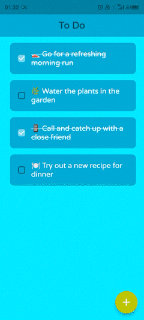
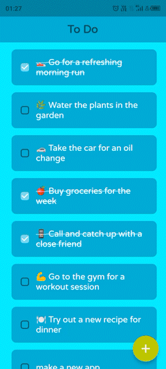

# Simple ToDo App

This is a simple todo app built using Flutter. It allows users to create and manage their tasks in a convenient way.

## Features

- Create new tasks with a title
- Mark tasks as complete or incomplete
- Delete tasks

---

## Demo

### Creating new Todo



### Deleting Todo



<!-- <div>
  
  
</div> -->

---

## Installation

1. Clone the repository:

```bash
git clone https://github.com/shahnawazdev/ToDo.git
```

2. Change to the project directory:

```bash
cd ToDo
```

3. Install dependencies:

```bash
flutter pub get
```

4. Run the app:

```bash
flutter run
```


## Versions Used

- Flutter SDK: 3.7.3
- Dart SDK: 2.19.2
- DevTools version 2.20.1
- Flutter Framework: 3.7.3
- Android SDK: 33.0.0

## Contributing

Contributions are welcome! If you encounter any issues or have suggestions for improvements, please feel free to open an issue or submit a pull request.

## License

This project is licensed under the [GNU General Public License v3.0](LICENSE).
